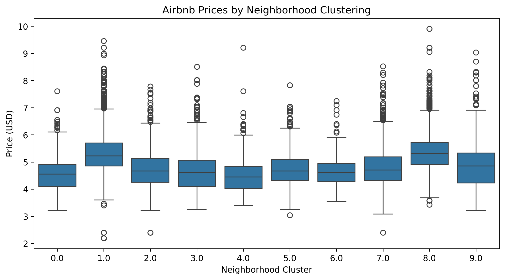
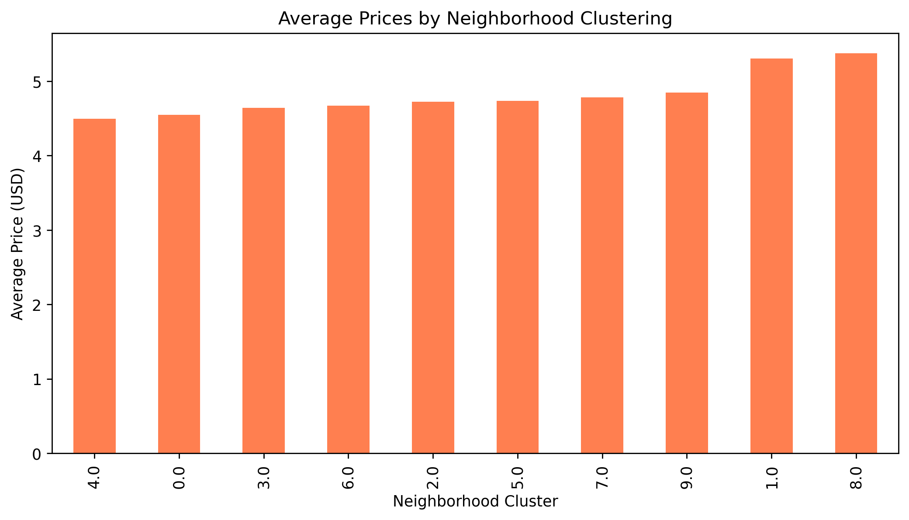
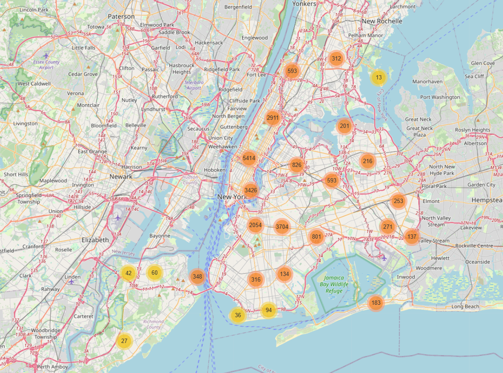
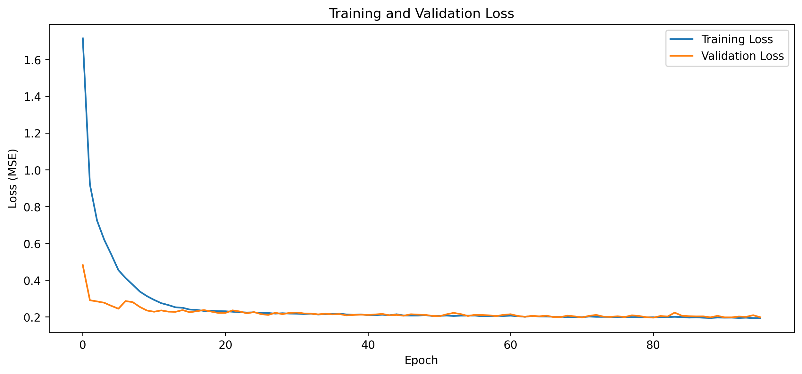
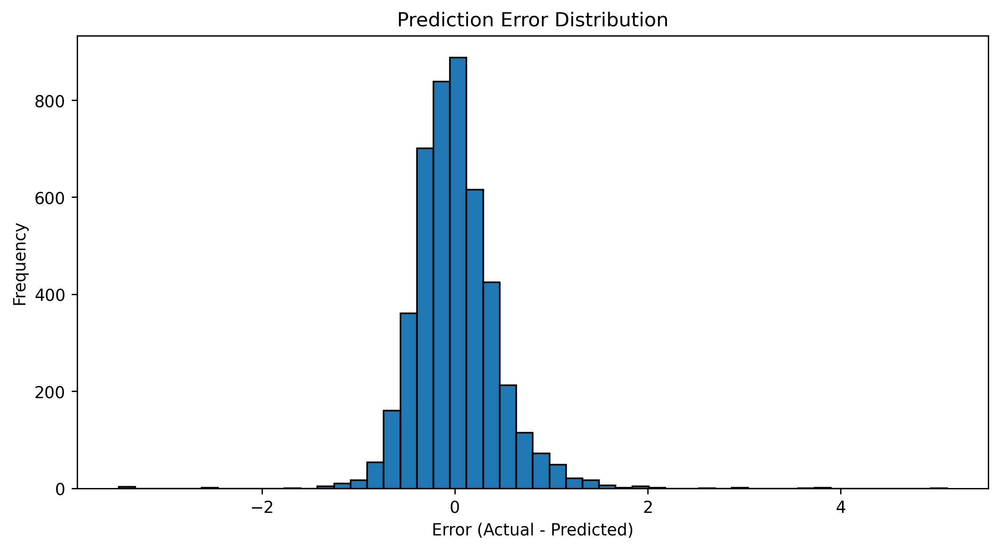

# NYC Airbnb Price Prediction & MLOps Pipeline

## Project Overview
This project focuses on building a machine learning pipeline to predict Airbnb prices in New York City. The model was developed using TensorFlow, integrated with a FastAPI-based microservice, and containerized using Docker for portability and scalability.

## Key Features
- **Data Preprocessing & Feature Engineering**: Cleaning, encoding categorical variables, clustering locations, and scaling numerical data.
- **Model Training & Evaluation**: Using a neural network built with TensorFlow to predict Airbnb prices.
- **API Deployment**: Implemented a FastAPI service for real-time model inference.
- **Dockerized Infrastructure**: Ensuring smooth deployment and replication.
- **Performance Analysis**: Error analysis and visualization.

---

## Dataset & Preprocessing
We used the NYC Airbnb dataset and performed various data preprocessing steps:
- **Dropping Unnecessary Columns**: Removed ID, URL, host information, etc.
- **Handling Missing Values**: Applied mean, median, and specific rules for different features.
- **Encoding Categorical Variables**: Used One-Hot Encoding and Binary Encoding.
- **Location-Based Clustering**: Applied K-Means clustering to group similar neighborhoods.
- **Feature Scaling**: Used MinMaxScaler for normalization.

### Example Visualization:
**Airbnb Prices by Neighborhood Clustering**


**Average Prices by Neighborhood**


---

## Interactive Map
An interactive map was created to visualize Airbnb listings with clustering applied.

**Airbnb Clusters Map**


**View the interactive version here:** [Airbnb Clusters Map](https://67bd50d7c7dbbff852419b4c--glowing-marshmallow-41dc8e.netlify.app/)

---

## Model Training
The model is a deep neural network built with TensorFlow, containing multiple dense layers and dropout for regularization.

```python
# Model Architecture
model = keras.Sequential([
    layers.Input(shape=(X_train_scaled.shape[1],)),
    layers.Dense(128, activation="relu"),
    layers.Dropout(0.3),
    layers.Dense(64, activation="relu"),
    layers.Dropout(0.3),
    layers.Dense(32, activation="relu"),
    layers.Dropout(0.3),
    layers.Dense(1)
])

# Compile the model
model.compile(optimizer="adam", loss="mse", metrics=["mae"])
```

### Training & Validation Loss


The model was trained with early stopping to prevent overfitting and achieved the following results:
- **Test Set Loss (MSE):** 0.1958
- **Test Set Mean Absolute Error (MAE):** 0.3131

---

## Model Evaluation
After training, we evaluated the model's predictions compared to actual prices.

```python
# Model evaluation
comparison_df = pd.DataFrame({
    "Actual Price": y_test_filtered.values,
    "Predicted Price": y_pred.flatten()
})
```

### Prediction Error Distribution


---

## API Deployment with FastAPI
A FastAPI microservice was developed to serve the model's predictions.

```python
from fastapi import FastAPI
import tensorflow as tf
import numpy as np

app = FastAPI()
model = tf.keras.models.load_model("airbnb_price_model.h5")

@app.post("/predict")
def predict_price(features: list):
    input_data = np.array(features).reshape(1, -1)
    prediction = model.predict(input_data)
    return {"predicted_price": float(prediction[0,0])}
```

- Tested locally using **Postman** and **cURL**.
- Example request:
```bash
curl -X 'POST' \
  'http://localhost:8000/predict' \
  -H 'Content-Type: application/json' \
  -d '{"features": [3, 2, 1, 45.0, 5.0, 100.0, 1, 0, 3, ..., 0, 1, 0]}'
```

---

## Docker Containerization
To make the service portable, the API was containerized using Docker.

### Dockerfile:
```dockerfile
FROM python:3.9
WORKDIR /app
COPY requirements.txt .
RUN pip install --no-cache-dir -r requirements.txt
COPY . .
CMD ["uvicorn", "app:app", "--host", "0.0.0.0", "--port", "8000"]
```

### Steps to Run Locally with Docker:
```bash
docker build -t airbnb-model-api .
docker run -p 8000:8000 airbnb-model-api
```

---

## Technologies Used
- **Machine Learning**: Python, TensorFlow, Keras, Scikit-learn
- **Data Processing**: Pandas, NumPy, Matplotlib, Seaborn
- **API Development**: FastAPI
- **Deployment**: Docker
- **Visualization**: Folium (Interactive Map), Matplotlib
